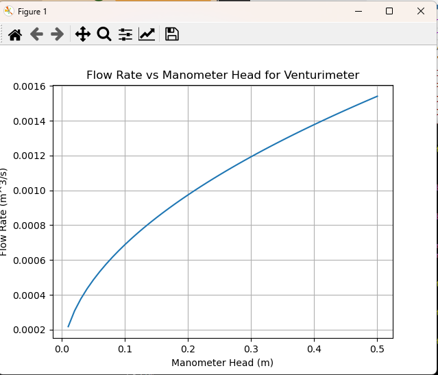
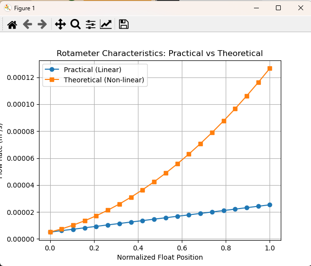
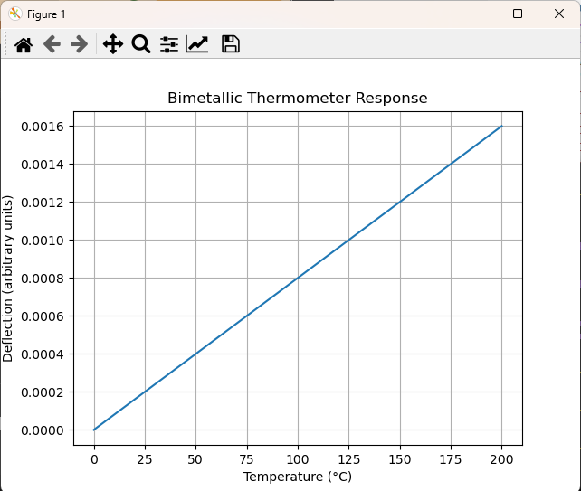
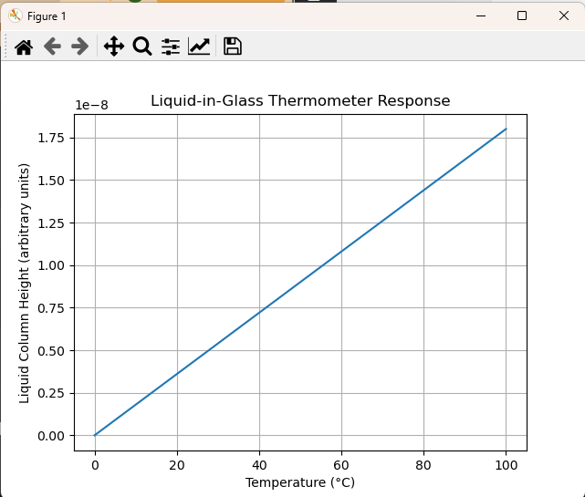
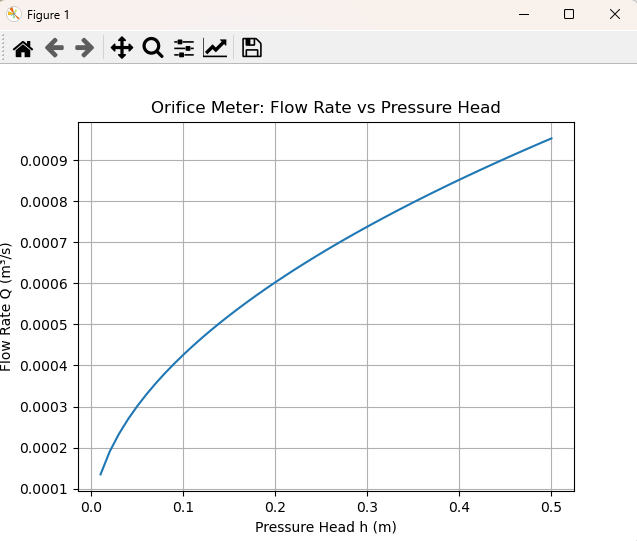
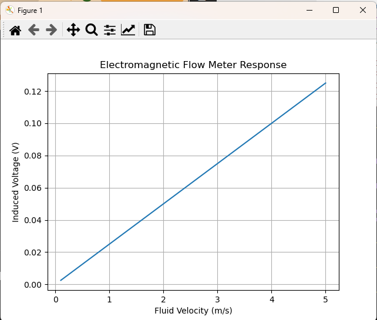
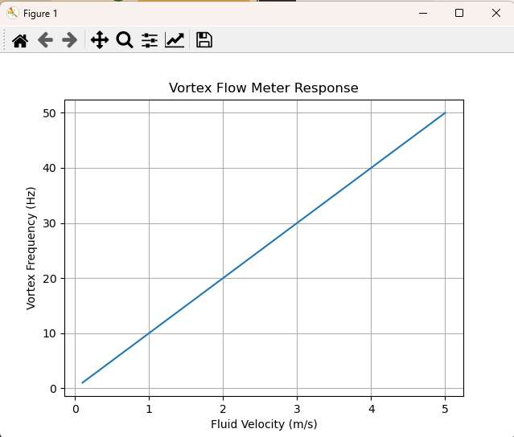
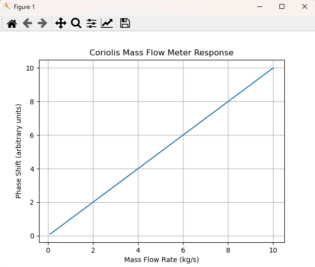

Virtual Instrumentation Lab is a Python-based simulation project that models the working principles of classical and modern flow and temperature measurement instruments used in industrial instrumentation systems. The project acts as a physics-based virtual lab, allowing users to study instrument behavior without physical hardware.

The simulations are built using governing equations from fluid mechanics, thermodynamics, and electromagnetic theory, and results are visualized through plots and an interactive GUI dashboard.

## Objectives

- To simulate the behavior of industrial measurement instruments using first-principle equations
- To visualize the relationship between physical parameters such as pressure, flow rate, velocity, and temperature
- To provide a virtual laboratory environment for instrumentation learning and experimentation
- To demonstrate digital twin concepts for physical measurement systems

## Project Structure

```
virtual-instrumentation-lab/
├── instruments/        # Individual instrument simulation modules
├── models/             # Mathematical models
├── gui/                # GUI dashboard
├── screenshots/        # Output plots
├── report/             # Documentation
├── main.py             # Entry point
├── requirements.txt
└── README.md
```

## Instruments Simulated

### Flow Measurement Instruments
- Venturimeter
- Orifice Meter
- Rotameter (theoretical non-linear and practical linear characteristics)
- Electromagnetic Flow Meter
- Vortex Shedding Flow Meter
- Coriolis Mass Flow Meter

### Temperature Measurement Instruments
- Bimetallic Thermometer
- Liquid-in-Glass Thermometer

## Technologies Used

- Python
- NumPy
- Matplotlib
- Tkinter
- Git and GitHub

## How to Run the Project

1.Clone the repository:

- git clone https://github.com/diya-18/virtual-instrumentation-lab.git
- cd virtual-instrumentation-lab

2.Install dependencies:
pip install -r requirements.txt

3.Run the application:
python main.py

4.Use the GUI to select an instrument and run its simulation.

## Simulation Screenshots

### Venturimeter


### Rotameter (Linear vs Non-linear)


### Bimetallic Thermometer


### Liquid-in-Glass Thermometer


### Orifice Meter


### Electromagnetic Flow Meter


### Vortex Flow Meter


### Coriolis Mass Flow Meter

